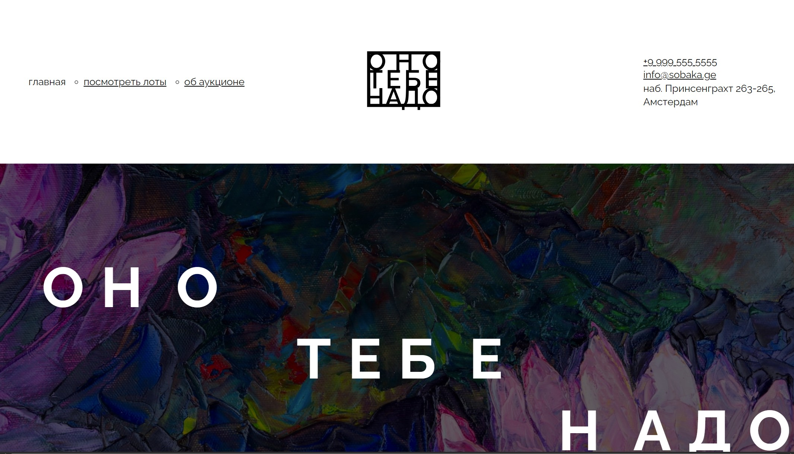

# Проект первого модуля ["Оно тебе надо"](https://sanyazola.github.io/ono-tebe-nado/).

#  *Оно тебе надо*

**Оно тебе надо** — Интернет сервис аукцион

[Демо-страница](https://sanyazola.github.io/ono-tebe-nado/)

## Описание

Проект выполнен только на HTML и CSS.

### 🚀 Возможности:
- Кликабельные ссылки.

### Технологии и стек
- Grid-layout.
- Flexbox.
- Структуры БЭМ классов.
- Добавление фотограций через src.

